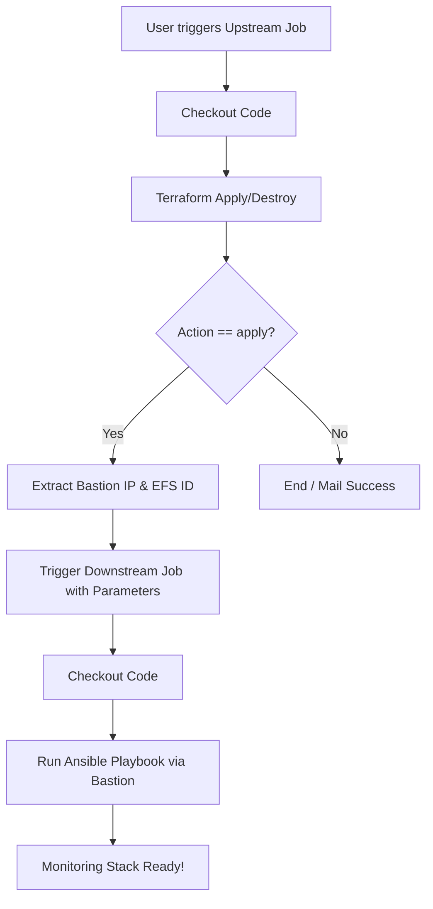

# Jenkins CI/CD Setup and Execution Guide

This guide details how to set up and run the one-click infrastructure provisioning and configuration pipelines in Jenkins using [Jenkinsfile.infra](file:///d:/AWS/Assignment-05/jenkins/Jenkinsfile.infra) and [Jenkinsfile.ansible](file:///d:/AWS/Assignment-05/jenkins/Jenkinsfile.ansible).

## Overview

The deployment is split into two automated pipelines for a clean separation of concerns:
1. **Upstream Job (`Downstream-Ansible-Trigger / Monitoring-Infra-Apply`)**: Executes the Terraform provisioning. Upon successful completion, it dynamically fetches the Terraform outputs (`bastion_public_ip` and `efs_id`) and triggers the downstream configuration job.
2. **Downstream Job (`Downstream-Ansible-Config`)**: Runs the Ansible playbook to install, configure, and mount systems on the target monitoring nodes via the Bastion proxy.

---

## Prerequisites & Credentials Configuration

Before configuring the pipeline jobs, ensure the following credentials are added to Jenkins under the global domain:

1. **AWS Access Credentials**:
   * **Access Key ID**: Create a **Secret Text** credential named `aws-credentials-id` containing your AWS Access Key.
   * **Secret Access Key**: Create a **Secret Text** credential named `aws-secret-credentials-id` containing your AWS Secret Access Key.
2. **SSH Private Key Credentials**:
   * Create a **SSH Username with private key** credential named `aws-ssh-key-id`.
   * Username: `ec2-user`
   * Private Key: Paste the contents of `~/.ssh/assignment-6.pem` (the SSH private key associated with the `assignment-6` key pair in AWS).
3. **Jenkins Shared Library**:
   * The pipelines rely on a shared library: `@Library('my-shared-library') _`. 
   * Ensure this library is configured under *Manage Jenkins* -> *System* -> *Global Pipeline Libraries* pointing to your team's helper utilities (defining `runTerraform` and `runAnsible`).

---

## Job Configurations

### 1. Upstream Job: Infrastructure Provisioning (`Monitoring-Infra`)
* **Job Type**: Pipeline
* **Definition**: Pipeline script from SCM
* **SCM**: Git (select your repository URL)
* **Script Path**: `jenkins/Jenkinsfile.infra`
* **Parameters** (Check "This project is parameterized"):
  * `ACTION`: Choice (`apply`, `destroy`)
  * `ENVIRONMENT`: Choice (`dev`)
  * `NOTIFICATION_EMAIL`: String (Optional status notification email)

### 2. Downstream Job: Node Configuration (`Downstream-Ansible-Config`)
* **Job Type**: Pipeline
* **Definition**: Pipeline script from SCM
* **SCM**: Git (select your repository URL)
* **Script Path**: `jenkins/Jenkinsfile.ansible`
* **Parameters** (Check "This project is parameterized"):
  * `BASTION_IP`: String (Passed dynamically by upstream job)
  * `EFS_ID`: String (Passed dynamically by upstream job)
  * `ENVIRONMENT`: Choice (`dev`)
  * `NOTIFICATION_EMAIL`: String (Optional status notification email)

---

## Running the Pipelines

### 1. Deployment (Apply)
1. Navigate to the **Monitoring-Infra** job in Jenkins.
2. Click **Build with Parameters**.
3. Select `apply` under **ACTION** and `dev` under **ENVIRONMENT**.
4. Click **Build**.
5. The pipeline will:
   * Provision the AWS VPC, Subnets, EFS, Bastion, ALB, and ASG.
   * Query the newly created outputs.
   * Trigger the **Downstream-Ansible-Config** job, passing the Bastion IP and EFS ID.
   * The downstream job will configure Prometheus, Node Exporter, Alertmanager, mount EFS, and start the Grafana service.

### 2. Destruction (Destroy)
1. Navigate to the **Monitoring-Infra** job in Jenkins.
2. Click **Build with Parameters**.
3. Select `destroy` under **ACTION**.
4. Click **Build**.
5. The pipeline will run `terraform destroy` and tear down the infrastructure components securely.
